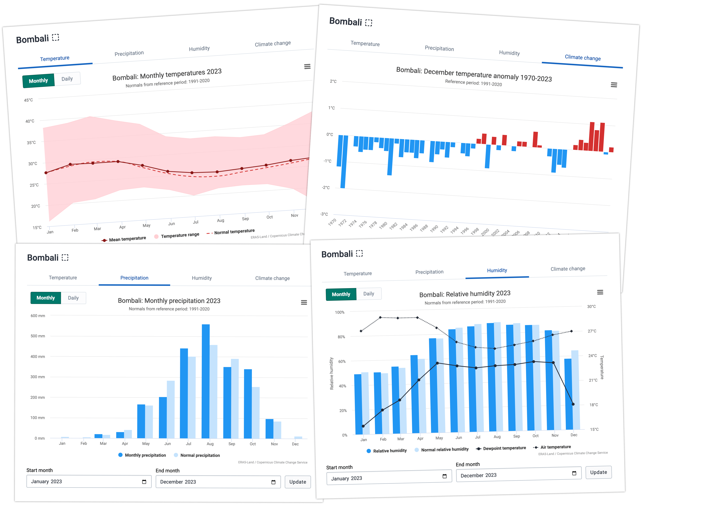

# DHIS2 Climate App

---

## General Documentation

### Overview

This app allows you to explore and import climate/weather data into DHIS2.

### Data Sources

-   **ERA5-Land**: By default, the app uses ERA5-Land, a highly accurate and complete global climate dataset.
-   **ENACTS**: If ENACTS is configured (see Admin Documentation), the app can also use ENACTS DST as a data source for local climate data.

> 

---

## Admin Documentation

### ENACTS Setup Instructions

The ENACTS API is made available to this app using a DHIS2 route. To set up ENACTS integration, follow these steps:

1. **Follow the [DHIS2 Routes documentation](https://docs.dhis2.org/en/develop/using-the-api/dhis-core-version-master/route.html)** to set up the route. Make sure to use the documentation specific to your DHIS2 version, as there are some differences between versions.

2. **Route configuration fields:**

    - The following fields must be set in the route configuration. Note that the `code` must be `enacts`.
    - **name**: Choose a name that indicates this route is to ENACTS DST
    - **code**: `enacts`
    - **url**: The URL where your ENACTS DST is hosted. You must append `/**` to the URL.
    - **headers**:
        - `Content-Type`: `application/json`
        - `X-API-Key`: _Your ENACTS API key here_
    - **disabled**: `false`

3. **Example configuration:**

```json
{
    "name": "ENACTS API",
    "code": "enacts",
    "url": "https://your-enacts-dst-url/**",
    "headers": {
        "Content-Type": "application/json",
        "X-API-Key": "Your enacts api key here"
    },
    "disabled": false
}
```

After configuring the route, the ENACTS API will be available for use in the Climate app.

---

## Developer Documentation

This project was bootstrapped with [DHIS2 Application Platform](https://github.com/dhis2/app-platform).

### Available Scripts

In the project directory, you can run:

#### `yarn start`

Runs the app in the development mode.<br />
Open [http://localhost:3000](http://localhost:3000) to view it in the browser.

The page will reload if you make edits.<br />
You will also see any lint errors in the console.

#### `yarn test`

Launches the test runner and runs all available tests found in `/src`.<br />

See the section about [running tests](https://platform.dhis2.nu/#/scripts/test) for more information.

#### `yarn build`

Builds the app for production to the `build` folder.<br />
It correctly bundles React in production mode and optimizes the build for the best performance.

The build is minified and the filenames include the hashes.<br />
A deployable `.zip` file can be found in `build/bundle`!

See the section about [building](https://platform.dhis2.nu/#/scripts/build) for more information.

#### `yarn deploy`

Deploys the built app in the `build` folder to a running DHIS2 instance.<br />
This command will prompt you to enter a server URL as well as the username and password of a DHIS2 user with the App Management authority.<br/>
You must run `yarn build` before running `yarn deploy`.<br />

See the section about [deploying](https://platform.dhis2.nu/#/scripts/deploy) for more information.
